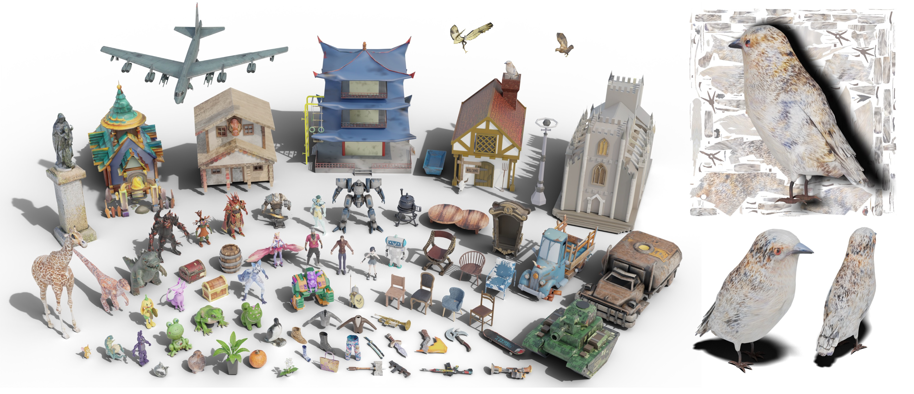
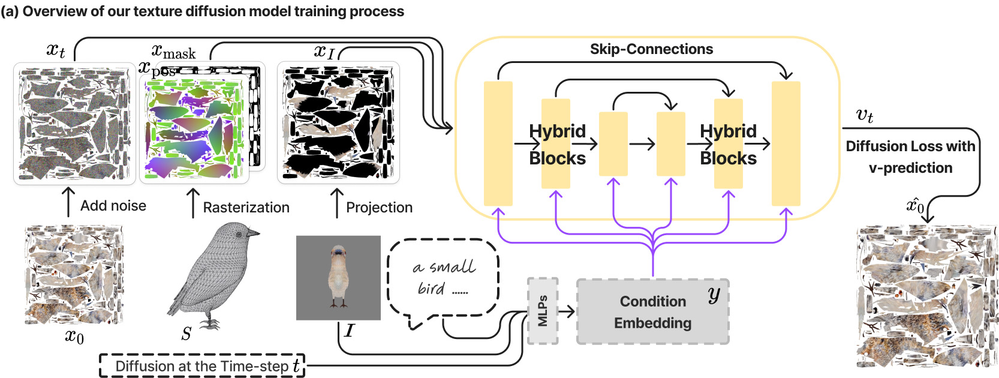
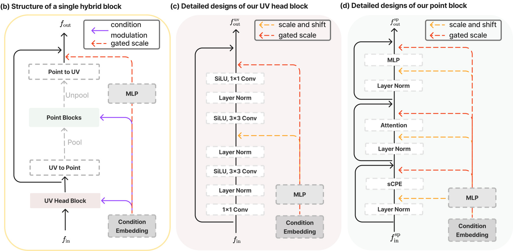

# 
TEXGen: a Generative Diffusion Model for Mesh Textures (SIGGRAPH Asia 2024 & TOG 2024)

### 
[Project Page](https://cvmi-lab.github.io/TEXGen/) | [Paper](#)

    

***TEXGen*** is a feed-forward texture generation model that diffuses albedo texture map directly on the **UV domain**. The codebase is built using PyTorch Lightning.

## Overview

    
    

## 🌟 Code is Coming Soon

  <em>Stay tuned for the upcoming code release!</em>

